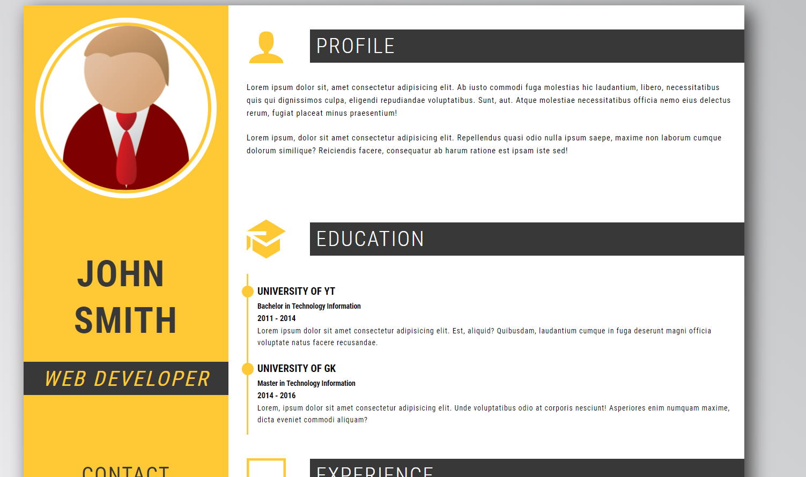

# CV 

Website made as a recruitment assignment.
I was task to replicate what I could see on a JPG picture with HTML and CSS as best as I could. As a little "bonus" I was supposed to implement short quiz which can be seen when the page is loaded. 
In order to se the CV you have to answear correctly on all question (and belive me when I tell you that they are not hard)

In order to see a demo visit [this link](https://tompod92.github.io/CV-zadanie/)

